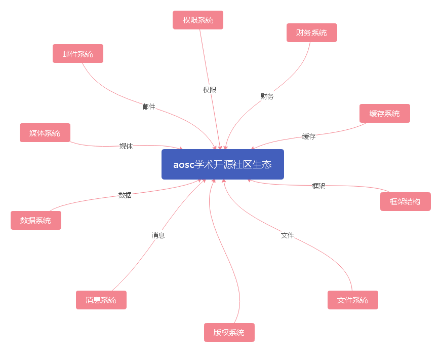
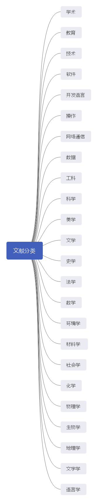
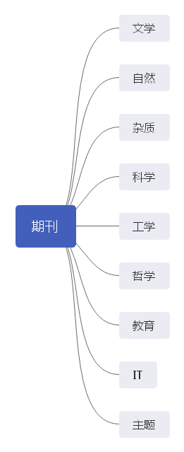

# AOSC

[toc]

# 简介

***项目是一个开源项目，目前正在开发中。期待关注***

**AOSC** 是（***Academic Open Source Community***）的缩写，中文为***学术开源社区***。开发的本意是为了为更多学子爱好学术的用户提供一个相对良好的学术研究成果的发布平台，以及提供其他他人学术成果的下查询预览、下载、以及后期会上线的学术论文查重服务。

我们的目的是励志于提供更好的服务，更贴切于实际的收费价格，以及更合理的平台管理制度等等。

>  **使用技术**
>
>  当前使用技术
>
>  spring 
>
>  spring mvc
>
>  mybatis
>
>  maven
>
>  redis
>
>  mysql
>
>  tomcat
>
>  vue
>
>  layui
>
>  bootstrap
>
>  jquery
>
>  git
>
>  freemarker
>
>  element ui
>
>  
>
>  未来会使用
>
>  mongodb

前后端不分离时讲采用freemarker +jquery+layui+bootstrap 同时会开放前后端的连接api为前端分离开发的前端提供服务。但api会比前后端不分离的情况下晚一代发布。

前后端分离将采用vue +layui +bootarap其他开发爱好者也可自行选择其它技术栈。

> 未来项目将转型为spring boot、spring cloud

***项目是一个开源项目，目前正在开发中。***

> 有喜欢的可以 star 、fork 以及加入我们，为这个项目添加不同的特色模块功能。
>
> 也可以私信联系、加入我们成为我们开发团队中的一员。
>
> ~~未来将会整个项目会涉及多平台开，多环境开发，若现在没有合适自己的方向，单又喜欢本项目的可以关注我们的官方开发者[官网](https://firstxiahoumy.github.io)，开发计划或者加入我们的，项目动态群聊微信、qq、钉钉圈子或者关注我们的团队公众号动态获取我们的开发进度，我们也会将开发进度实时同步至个端。~~

# logo设计

logo图标为本人自行设计，算不上很好。有相关专业的或爱好者可以为本项目设计其它logo、推送至远程[仓库](https://github.com/firstxiahoumy/aosc)或者联系我们团队成员，也可通过我们的公布的邮箱地址，发送到我们的邮箱中。

*附件*：

> ~~***邮箱的格式为***~~
>
> ~~收件人：aliketh.my@example.com~~
>
> ~~标题为：项目名称+logo名称~~
>
> ~~内容：包括 姓名 + 联系方式（不方便透露真实信息的可以填写昵称+联系邮箱**可用**）~~
>
> ​			~~设计理念（选填）~~
>
> ~~logo文件附件形式发送~~

# 结构

# 项目功能

## 主系统功能  

### 用户系统

#### **用户登录**

目前用户只能通过注册的aosc用户登录，其他登录方式敬请期待。

为防止恶意攻击，每个账号每天有5次容错机会，超过容错机会后账号将锁定24小时，到达指定时间间隔之后自动解除限制。

#### **用户注册**

目前仅支持自定义名称注册，电话以及邮箱注册敬请期待。注册页面只能注册普通用户、以及企业用户。组织以及机构用户需要通过管理员注册。

#### **用户找回**

用户可以通过注册时使用的电话或邮箱进行修改。用户修改的密码必须不同于原密码。

#### **用户权限**

用户权限分为游客、普通、企业、组织、机构。其中普通用户中又细分为普通注册用户、普通实名用户、普通付费用户、超级付费用户。

游客会对其进行浏览、下载限制。每一台设备每天浏览的论文、期刊次数限定为3次，设备次数清零时间为24：00，已经浏览过的论文、期刊内容当天24：00之前随时都可以重复在线预览，超过时间之后就会重新消耗预览次数。

>  *注明：* 浏览限制是指用户通过检索后点击进入论文文献、期刊之后点击了全文预览功能才会被记录为消耗浏览次数

普通用户注册用户将解锁浏览限制、下载限制提升为每天最高下载次数为10次，下载限制在当天24：00后重置。

普通实名用户和注册用户一样没有浏览限制。下载限制提高至25次/天。

普通付费用户和注册用户一样没有浏览限制。下载限制提高至50次/天。（具体收费以项目发布之后为准）

超级付费用户和注册用户一样没有浏览限制。下载限制提高至300次/天。（具体收费以项目发布之后为准）

企业用户注册之后必须进行企业验证才能够正常使用其内部功能。（企业用户具体细节，项目发布之后在企业用户指导手册以及企业用户管理中有具体描述）

组织、机构权限（暂不公布，了解具体情况需要在项目发布后联系管理员提供相关证明，获取）。

#### 用户注销账户

用户注销账户之后将清除用户数据。若用户在站内有充值、购买会员注销账户后账户内剩余的金额一律不退回、购买的会员也将失效。若用户在站内有发表过自己的作品，用户注销账户后，我们默认会留下的发表作品与您的联系方式，若用户需要删除所有数据可在注销账户时勾选彻底删除所有数据选项。

### 分类

#### 论文文献

#### 期刊

### 查询

支持全站的模糊查询，以及分类查询，多条件模糊查询。

## 子系统功能

### 文件系统

### 邮件系统

### 媒体系统

### 权限系统

### 版权系统

### 缓存系统

### 财务系统

### 消息系统

# 数据库

# 关于

