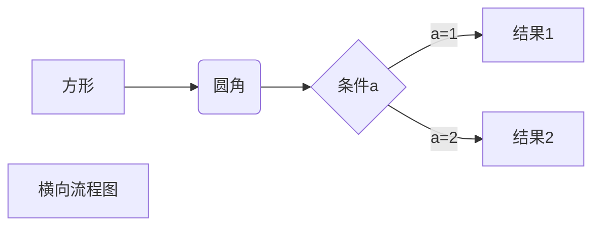
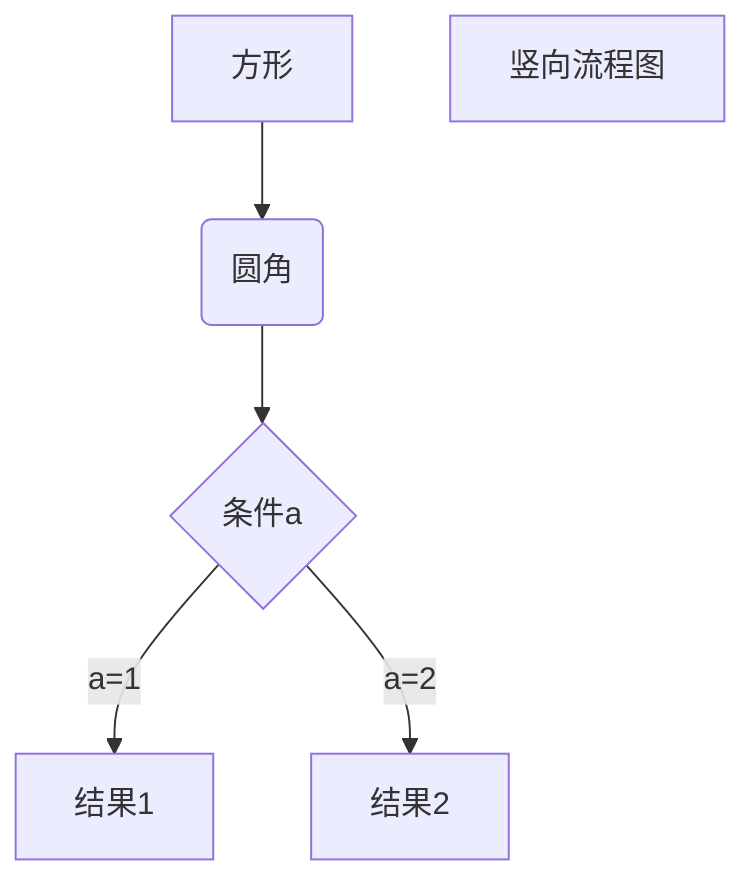
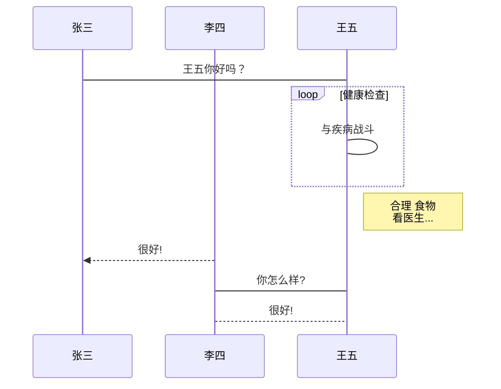
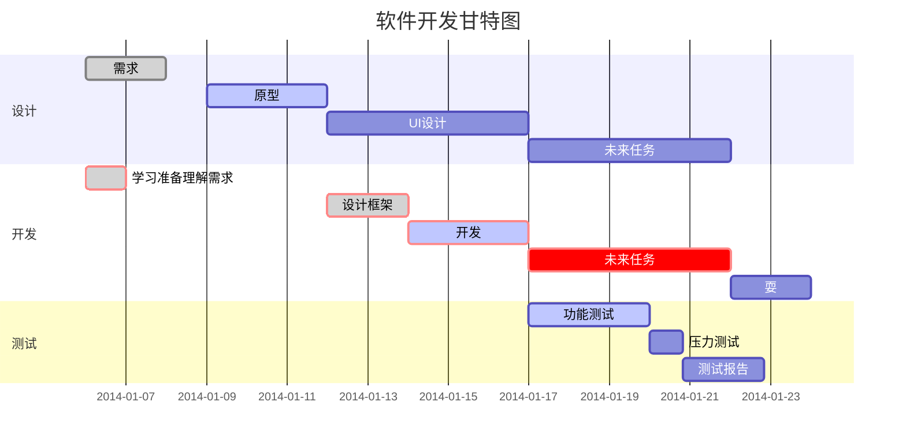

*fbdxfsfsfs*
_fdjbdlk_
**dfjvbdsfbjfd**
__fdsvdfbjdf__
***fdbdjsfbkfds***
___fdbkkdfvk___

[typora](https://www.baidu.com/s?wd=typora%E6%96%87%E4%BB%B6%E6%95%B0&rsv_spt=1&rsv_iqid=0x8395f5f0002cbeaa&issp=1&f=8&rsv_bp=1&rsv_idx=2&ie=utf-8&rqlang=cn&tn=baiduhome_pg&rsv_enter=1&rsv_dl=tb&rsv_btype=t&inputT=15394&rsv_t=ed3f0i5yeefxTMskgzmv0x8GBXA6iME1lEc854R%2BoO8je9PEWJni%2FSYX%2B1MejSWiCOVd&oq=typora%25E5%25BF%25AB%25E6%258D%25B7%25E9%2594%25AE&rsv_pq=c4796b18002ee2e4&rsv_sug3=39&rsv_sug1=32&rsv_sug7=100&rsv_sug2=0&prefixsug=typora%25E6%2596%2587%25E4%25BB%25B6%25E6%2595%25B0&rsp=4&rsv_sug4=17490)

<a href="http://www.baidu.com">baifu</a>


<div style="border-left: red solid 5px;padding-left: 10px;">
    bjdslkdfknlsdfl;;lfdsn
</div>

_______________

***

* * *

*****

------

~~test~~


<u>fdjkdfbkjd</u>


[^fdkbfdkk]

[^fbdkbfksnifsakls]: dkfanbkndakldfnknbd

* 

+ 

- 

> fdjbakbfdj
>
>fdbiksfdslk
>
>dfvbsjk dfjvf dkbs
>
>> dfjbslkdbdlsk
>>
>> fdvhkbdsl
>>
>> dfjkvbkjdbsj
>>
>> > bsjfdkbjdsbfds
>> >
>> > fdjsbldksnklfd
>> >
>> > djbsfdbjfd


 


[](ifskadvk)


|      |      |      |
| ---- | ---- | ---- |
|      |      |      |


| -:   | :-:  | :-   |
| ---- | ---- | ---- |
|      |      |      |


$$
\mathbf{V}_1 \times \mathbf{V}_2 =  \begin{vmatrix} 
\mathbf{i} & \mathbf{j} & \mathbf{k} \\
\frac{\partial X}{\partial u} &  \frac{\partial Y}{\partial u} & 0 \\
\frac{\partial X}{\partial v} &  \frac{\partial Y}{\partial v} & 0 \\
\end{vmatrix}
${$tep1}{\style{visibility:hidden}{(x+1)(x+1)}}
$$


1、横向流程图源码格式：



2、竖向流程图源码格式：



3、标准流程图源码格式：

```flow
st=>start: 开始框
op=>operation: 处理框
cond=>condition: 判断框(是或否?)
sub1=>subroutine: 子流程
io=>inputoutput: 输入输出框
e=>end: 结束框
st->op->cond
cond(yes)->io->e
cond(no)->sub1(right)->op
```

4、标准流程图源码格式（横向）：

```flow
st=>start: 开始框
op=>operation: 处理框
cond=>condition: 判断框(是或否?)
sub1=>subroutine: 子流程
io=>inputoutput: 输入输出框
e=>end: 结束框
st(right)->op(right)->cond
cond(yes)->io(bottom)->e
cond(no)->sub1(right)->op
```

5、UML时序图源码样例：

```sequence
对象A->对象B: 对象B你好吗?（请求）
Note right of 对象B: 对象B的描述
Note left of 对象A: 对象A的描述(提示)
对象B-->对象A: 我很好(响应)
对象A->对象B: 你真的好吗？
```

6、UML时序图源码复杂样例：

```sequence
Title: 标题：复杂使用
对象A->对象B: 对象B你好吗?（请求）
Note right of 对象B: 对象B的描述
Note left of 对象A: 对象A的描述(提示)
对象B-->对象A: 我很好(响应)
对象B->小三: 你好吗
小三-->>对象A: 对象B找我了
对象A->对象B: 你真的好吗？
Note over 小三,对象B: 我们是朋友
participant C
Note right of C: 没人陪我玩
```

7、UML标准时序图样例：



8、甘特图样例：




```
dfhsikldsfbklsdsd
dfsfbklsdbksng
sdbnkdlsbkbsfsd;4ds4

dsfb
dfb
sb
s

dsfbds

sdgb
sd
b
sdb
sd
```


